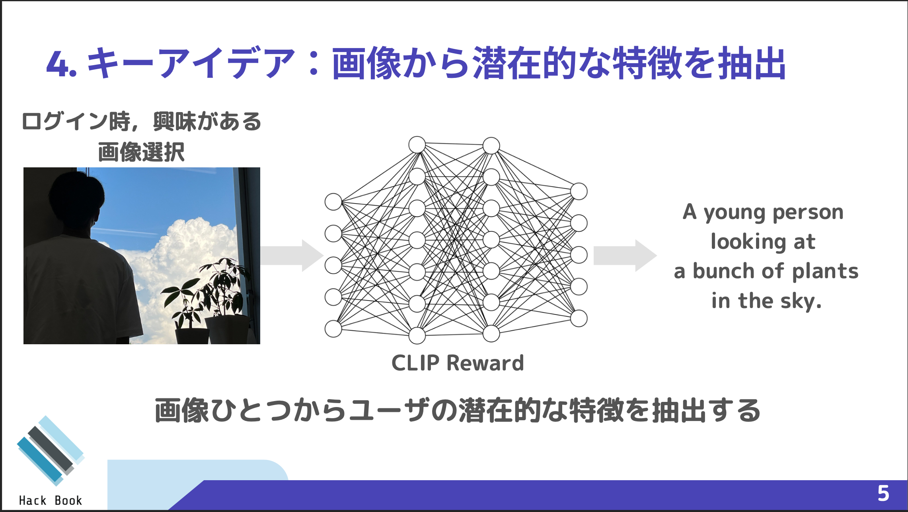

# 技育CAMP (Hack-Book)
サポーターズが主催する[技育 CAMP ](https://talent.supporterz.jp/geekcamp/)に参加し，企業賞をいただいたのでリポジトリを公開します！

## Hack-Book
私たちは，近年のレコメンドエンジンのアルゴリズムがユーザの属性情報やクリック情報，購入履歴のような行動ログに最適化されているため，ユーザの新しいコンテンツや本，人の出会いを妨げてしまっているという問題に着目し，この問題を解決するような本をレコメンドするアルゴリズムならびにシステムの提案を行いました．

*このリポジトリはバックエンドの実装です．

## ユースケース
ユーザは，システムのログイン時に複数の画像の中から自分の嗜好に合う画像の選択を行います(たとえば，ペット，家族，自然の画像が提示され，自然の画像を選択するといった具合です)．その画像をバックエンドで画像からテキスト情報に変換できる CLIP Reward という深層学習モデルを用いてテキスト情報を取得し，そのテキスト情報と楽天 API から取得した本の情報が類似する本をレコメンドするというアルゴリズムです．

## 発表資料
- [発表スライド](./data/hackbook.pdf)

## ブランチ規約
- feat/#イシュー番号_何をするか
